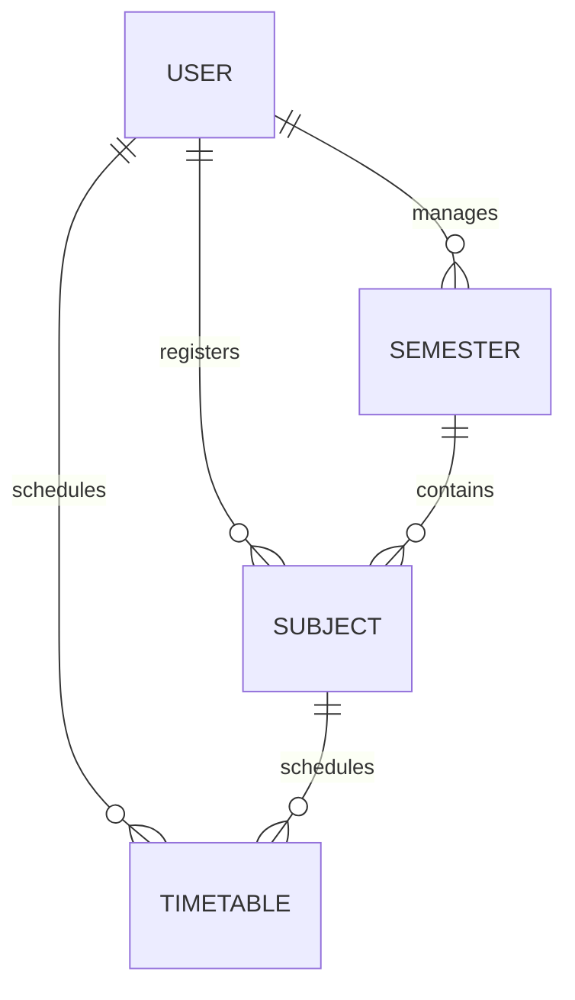
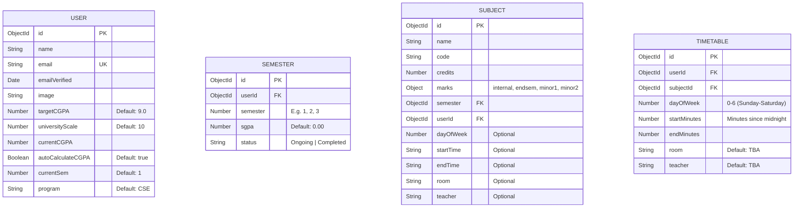
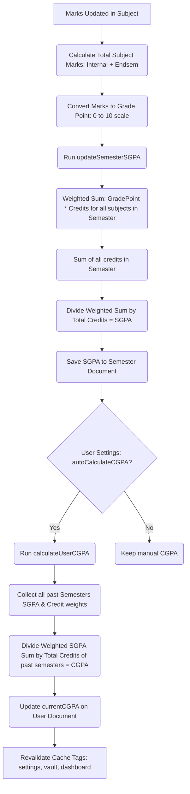

# Vidyavriksha 🌳: Advanced Developer & Architecture Reference

This is a comprehensive architectural guide for **Vidyavriksha**, the Engineer's Command Center for Academic Analytics. This document details the database relationships, folder structure, runtime data flow, server action functions, and advanced architectural decisions.

---

## 📁 1. Project Directory Structure Map

Vidyavriksha is built using **Next.js App Router** and **Mongoose (MongoDB)**. It relies on Next.js Server Actions to execute CRUD operations and DB triggers directly from client components.

```text
src/
├── actions/                  # Server Actions (Exclusively backend RPCs)
│   ├── DashboardPopulating.js# Command center schedule loaders
│   ├── analyticCharts.js     # Recharts dataset formatters
│   ├── semester.js           # Semester statistics, SGPA/CGPA engine
│   ├── subject.js            # Subject records & 10-point grade mapping
│   ├── user.js               # Account lifecycle & raw DB collection wipes
│   ├── userSettings.js       # Student config controller
│   └── vault.js              # Vault analytics loader
│
├── app/                      # Next.js App Router (Layouts & Navigation)
│   ├── (auth)/               # Authentication routing group
│   │   └── login/            # OAuth entry page
│   ├── Context/              # Client State providers (UserContext.js)
│   ├── api/                  # Edge API handlers (NextAuth catch-all endpoint)
│   ├── dashboard/            # Protected views
│   │   ├── analytics/        # Performance trends
│   │   ├── timetable/        # Class scheduler
│   │   ├── settings/         # Configuration panel
│   │   ├── simulator/        # GPA Path Simulator (unlocked current semester)
│   │   ├── vault/            # Document repository / Academic ledger
│   │   ├── layout.js         # Core layout, sidebar & session wrapper
│   │   └── page.js           # Bento-grid dashboard main page
│   ├── layout.js             # HTML document shell, font load
│   └── page.js               # Dynamic index redirector
│
├── components/               # UI components
│   ├── ui/                   # Primitive buttons, Toast, UniversalModal
│   ├── dashboard/            # Navigation sidebars, cards, lecture items
│   ├── analytics/            # GPA Simulator slider forms & chart wrapper
│   └── timetable/            # Complex timetables (CalendarUI, Week view)
│
├── lib/                      # Base infrastructure
│   ├── db.js                 # Mongoose connection cache singleton
│   ├── mongoClient.js        # NextAuth MongoDB client provider
│   └── utils.js              # Formatting and styling utilities (cn helper)
│
├── models/                   # Mongoose Database Schemas
│   ├── semester.model.js     # Semester schema (SGPA tracker)
│   ├── subject.model.js      # Core subject ledger (Credits, Marks, Optional timings)
│   ├── timetable.model.js    # Lecture timetable mapping
│   └── user.model.js         # Expanded user settings configuration
│
├── auth.js                   # NextAuth server configuration
└── auth.config.js            # Edge-compatible OAuth provider settings
```

---

## 🗄️ 2. Database Design & Entity Relationships (ERD)

The database maps student records to academic milestones. It enforces referential integrity through Mongoose middleware hooks and parallel transactional cascades:



### Schema Detailed Specification:



---

## ⚙️ 3. Computational GPA Engine Flow

The GPA engine automates semester-grade translation and cumulative point calculations. When a student updates subject marks, the following workflow is triggered:



### Grade Point Conversion Formula
Raw scores are evaluated via a 10-point scale:

$$\text{GradePoint}(\text{Marks}) = 
\begin{cases} 
10 & \text{if } \text{Marks} \ge 90 \\
9 & \text{if } 80 \le \text{Marks} < 90 \\
8 & \text{if } 70 \le \text{Marks} < 80 \\
7 & \text{if } 60 \le \text{Marks} < 70 \\
6 & \text{if } 50 \le \text{Marks} < 60 \\
5 & \text{if } 40 \le \text{Marks} < 50 \\
0 & \text{if } \text{Marks} < 40 
\end{cases}$$

### SGPA Evaluation Formula
For a semester $S$ containing subjects $s_1, s_2, ..., s_n$:

$$\text{SGPA} = \frac{\sum_{i=1}^{n} (\text{GradePoint}(s_i) \times \text{Credits}(s_i))}{\sum_{i=1}^{n} \text{Credits}(s_i)}$$

### CGPA Evaluation Formula
Given the current semester $C$, the cumulative GPA is calculated across all completed past terms ($sem < C$):

$$\text{CGPA} = \frac{\sum_{j=1}^{C-1} (\text{SGPA}(j) \times \text{TotalCredits}(j))}{\sum_{j=1}^{C-1} \text{TotalCredits}(j)}$$

---

## ⚡ 4. Detailed Server Actions Documentation (`src/actions/*`)

---

### 📊 `DashboardPopulating.js`

Loads schedule metadata.

#### `getDashboardData()`
* **Arguments**: None.
* **Flow**:
  1. Retrieves authenticated user and computes current server day-of-week index.
  2. Wraps the controller inside a cache helper (`getCachedDashboard`), caching the result for 24 hours (`86400s`) or until manually invalidated.
  3. Executes a parallel `Promise.all`:
     * Fetch timetable matching `dayOfWeek` sorted by `startMinutes`.
  4. Returns active dynamic schedule slots for the student.

---

### 📈 `analyticCharts.js`

Formats MongoDB document lists into JSON arrays structured for Recharts.

#### Functions:
* `stackedMarksData(SemId)`: Formats and returns subject internally vs externally scored parts: `{ subject: String, internal: Number, external: Number }`.
* `getSems()`: Loads all academic semesters. Sanitizes Mongoose schemas into raw JSON (`JSON.parse(JSON.stringify(TotalSemesters))`) to avoid hydration serializability errors on client views.
* `RadialChartData(SemId)`: Maps subject total scores out of 100 to feed radial gauge indicators.
* `fetchDistributedBarGraph(SemId)`: Filters out lab-based courses (`!name.toLowerCase().includes("lab")`) and prepares a distributed dataset: `{ subject, minor1, minor2, endsem }`.
* `fetchSGPAProgressionChart()`: Pulls GPA records across completed semesters to draw progression trends.

---

### 🎓 `semester.js`

Calculates grades and handles semester lifecycles.

#### `deleteSemester(SemId)`
* **Arguments**: `SemId` (string).
* **Flow**:
  1. Queries all subjects belonging to the semester: `subject.find({ semester: SemId })`.
  2. Cascades delete queries across related collections inside a `Promise.all`:
     * Delete timetables containing any matching `subjectIds`.
  3. Deletes the subject documents.
  4. Deletes the semester document.
  5. Recalculates CGPA.
  6. Revalidates tags: `semester-${userId}`, `analytics-${userId}`, `vault-${userId}`, `dashboard-${userId}`.

#### `updateSemesterSGPA(SemId, userId)`
* **Arguments**: `SemId` (string), `userId` (string).
* **Flow**:
  1. Loads subjects belonging to the semester.
  2. Accumulates credit weights and grades using the standard formula.
  3. Updates the `sgpa` property on the `Semester` document.

#### `syncUserCGPAIfAuto(userId)`
* **Arguments**: `userId` (string).
* **Flow**:
  1. Inspects the user model setting `autoCalculateCGPA`.
  2. If enabled, re-evaluates all prior semesters and saves the resulting `currentCGPA` to the User document.

---

### 📚 `subject.js`

Controls subject records and marks logs.

#### Functions:
* `updateSubjectMarks(SubId, updatedMarks)`: Writes new marks components (`minor1`, `minor2`, `internal`, `endsem`) to the database, then triggers `updateSemesterSGPA` and `syncUserCGPAIfAuto`.
* `deleteSubject(SubId)` / `addSubject(subjectData)`: Processes core additions/deletions. Re-evaluates SGPA/CGPA post-execution. Automatically manages synchronization of timetable slots when subject timings are supplied.

---

### 👤 `user.js`

Manages account profiles.

#### `deleteAccount()`
* **Arguments**: None.
* **Flow**:
  1. Resolves active user session ID.
  2. Performs a complete account wipe across all database collections:
     - `Timetable`, `subject`, `Semester`, and `User`.
     - Direct raw MongoDB driver collection calls to clean up NextAuth `accounts` and `sessions` collections using raw ObjectIds.
  3. Invalidates all cached pages.

---

### ⚙ `userSettings.js`

Updates user dashboard layouts and configurations.

#### `updateUserSettings(data)`
* **Arguments**: `data` (Object containing name, program, target CGPA, etc.).
* **Flow**:
  1. Validates and saves updated settings.
  2. If `autoCalculateCGPA` is toggled on, it recalculates past terms.
  3. Invalidates `settings-${userId}` and `vault-${userId}` cache tags.

---

### 🔐 `vault.js`

Aggregates stats for the vault view.

#### `getVaultData()`
* **Arguments**: None.
* **Flow**:
  1. Fetches user details, semester records, and all registered subjects.
  2. Returns total credits, semester history, and user settings.

---

## 🛠️ 5. Advanced Engineering Patterns & Workarounds

---

### Pattern 1: Edge Compatibility Splitting (Auth Config)
* **Problem**: Next.js App Router relies on middleware to validate routes. Middleware executes on Vercel's **Edge Runtime**, which does not support Node.js native packages, sockets, or database connectors like Mongoose. Placing database integrations directly inside authentication configurations crashes the middleware compiler.
* **Solution**: Split configuration into two decoupled files:
  1. [auth.config.js](file:///D:/Early%20Projects/Student-Dashboard/src/auth.config.js): Handles Google OAuth settings, JWT configurations, and session ID token mappings. This file contains zero database imports and compiles on Vercel Edge.
  2. [auth.js](file:///D:/Early%20Projects/Student-Dashboard/src/auth.js): Instantiates database adapters (`MongoDBAdapter`) using `clientPromise` and merges them with `authConfig`. It runs only on server endpoints.
* **Benefit**: Restricts database code to Server Components/Actions while preserving middleware-level access checks on the edge.

---

### Pattern 2: Hot Module Replacement (HMR) Dual-Registration Workaround
* **Problem**: In Next.js development environments, HMR rebuilds file modules on every save. Mongoose compiles models on import. When a developer edits a file, Mongoose tries to re-compile the model, throwing: `OverwriteModelError: Cannot overwrite model once compiled`.
* **Solution**: Check model registry before registering schemas:
```javascript
const SubjectModel =
    mongoose.models.subject || mongoose.model("subject", subjectSchema);

// Register a capitalized alias to handle cross-schema populates cleanly
if (!mongoose.models.Subject) {
    mongoose.model("Subject", SubjectModel.schema);
}

export const subject = SubjectModel;
```
* **Benefit**: Prevents server crashes during local development hot-reloads.

---

### Pattern 3: Collapsible PC Sidebar & Synchronized Mobile Drawer
* **Problem**: Large navigation sidebars take up critical screen estate on desktop displays. They need to shrink to icon-only sizes dynamically. Concurrently, mobile views require a drawer toggle containing identical links, student details, and attributions, but formatted cleanly to prevent truncation.
* **Solution**: Implemented a responsive collapsible sidebar component ([SideBarNav.js](file:///D:/Early%20Projects/Student-Dashboard/src/components/dashboard/SideBarNav.js)) that tracks state (`isCollapsed`) via React state and persists it inside `localStorage`. The navigation triggers transition classes (`transition-[width] duration-300`) and adjusts links accordingly. The mobile navigation drawer layout ([MobileNav.js](file:///D:/Early%20Projects/Student-Dashboard/src/components/dashboard/MobileNav.js)) replicates links, placement, GPA Simulator buttons, and GitHub footnotes in vertical stack alignments.

---

### Pattern 4: Custom Dark Mode Input Aesthetics
* **Problem**: Standard HTML5 time and date inputs render ugly browser default scroll wheels, clock selectors, and placeholder dashes (`--:--`) that conflict with deep-space dark themes. Native indicators can also turn black and disappear on dark backgrounds.
* **Solution**: Applied standard `color-scheme: dark` styling to `<input type="time">` and `<input type="date">` elements. This forces modern browsers to natively render the clock/calendar icons in clean white. We then configured the WebKit sub-elements (fields wrapper and edit texts) to inherit the text color of the parent container, enabling conditional styling (dimmed `text-primary/30` opacity when empty vs full `text-primary` when selected).

---

### Pattern 5: Unified UI Overlays (Toast & UniversalModal)
* **Problem**: Browser-native `alert()` and `confirm()` dialogs block the main browser thread, cannot be customized to match a deep dark-mode theme, and ruin user flow.
* **Solution**: Installed standard framer-motion overlay primitives ([Toast.js](file:///D:/Early%20Projects/Student-Dashboard/src/components/ui/Toast.js) and [UniversalModal.js](file:///D:/Early%20Projects/Student-Dashboard/src/components/ui/UniversalModal.js)) across settings configuration views, profile forms, and weekly scheduling planners. All validation errors, database responses, and deletion workflows feed configuration objects to local React states to present sleek, non-blocking notification cards.

---

### Pattern 6: Auto-Unlock Grade Path Simulator
* **Problem**: Academic GPA path simulators freeze past semesters to maintain transcript integrity. However, the student's *current* semester must remain fully interactive/unlocked, allowing them to adjust expected grade distributions and run "what-if" projection scenarios in real-time.
* **Solution**: Programmed the CGPA simulator controller ([GPASimulator.js](file:///D:/Early%20Projects/Student-Dashboard/src/components/analytics/GPASimulator.js)) to pull the student's current sem parameter from context, iterate through historical SGPA inputs, and automatically lock terms matching `semester < currentSem`, leaving the current active semester fully editable.
