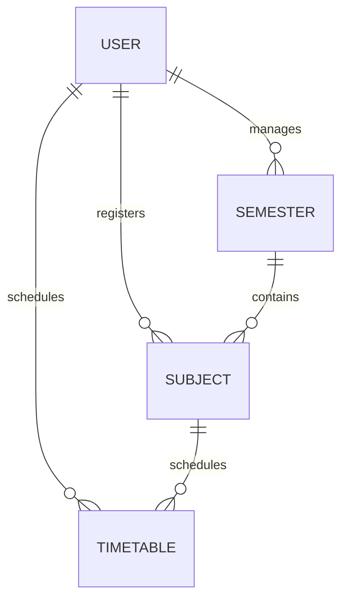
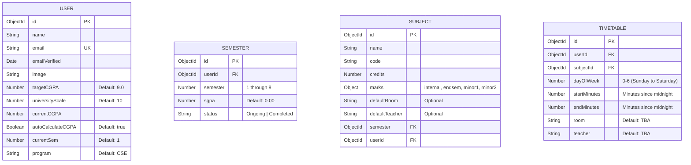

# Vidyavriksha: Advanced Developer & Architecture Reference

This is a comprehensive architectural guide for **Vidyavriksha**, the Student Command Center for Academic Analytics and Lifecycle Management. This document details the database relationships, directory structure, runtime data flow, server action signatures, and architectural patterns.

---

## 1. Project Directory Structure Map

Vidyavriksha is built using **Next.js App Router** and **Mongoose (MongoDB)**. It relies exclusively on Next.js Server Actions to execute mutations, calculations, and data transactions.

```text
src/
├── actions/                  # Next.js Server Actions (Backend RPCs)
│   ├── DashboardPopulating.js# Command center schedule and today's classes loader
│   ├── analyticCharts.js     # Datasets formatters for Recharts visualizations
│   ├── semester.js           # Semester statistics, marksheet exports, SGPA/CGPA engine
│   ├── subject.js            # Subject records, marks updates, and timetable slot scheduler
│   ├── user.js               # Account lifecycle and transactional data wipes
│   ├── userSettings.js       # Student configuration controller
│   └── vault.js              # Academic vault aggregated data loader
│
├── app/                      # Next.js App Router (Layouts, Routing & Pages)
│   ├── (auth)/               # Authentication route group
│   │   └── login/            # OAuth login page
│   ├── Context/              # Client State Provider (UserContext.js)
│   ├── api/                  # API routes (NextAuth route handler)
│   │   └── auth/             # [...nextauth] route handler
│   ├── dashboard/            # Protected views
│   │   ├── analytics/        # Performance trends & charts
│   │   ├── timetable/        # Multi-day weekly class scheduler
│   │   ├── settings/         # Configuration panel & course load management
│   │   ├── simulator/        # Interactive GPA Path Simulator
│   │   ├── vault/            # Document repository & official marksheets
│   │   ├── layout.js         # Core responsive layout & session wrapper
│   │   └── page.js           # Main dashboard bento grid
│   ├── layout.js             # Root HTML document shell
│   └── page.js               # Root redirector
│
├── components/               # React UI Components
│   ├── ui/                   # Toast notifications, UniversalModal
│   ├── dashboard/            # Navigation sidebars, mobile drawer, lecture cards
│   ├── analytics/            # GPA Simulator sliders, chart wrappers
│   ├── settings/             # Semester & subject configuration managers
│   └── timetable/            # CalendarUI & weekly scheduler
│
├── lib/                      # Infrastructure & Utilities
│   ├── db.js                 # Cached Mongoose connection singleton
│   ├── mongoClient.js        # NextAuth MongoDB client provider
│   └── utils.js              # Styling utilities (cn helper)
│
├── models/                   # Mongoose Database Schemas
│   ├── semester.model.js     # Semester schema (SGPA & status tracker)
│   ├── subject.model.js      # Subject ledger (Credits, Marks, Defaults)
│   ├── timetable.model.js    # Lecture timetable slot mapping
│   └── user.model.js         # Expanded user settings configuration
│
├── auth.js                   # NextAuth server configuration
└── auth.config.js            # Edge-compatible OAuth provider configuration
```

---

## 2. Database Design & Entity Relationships (ERD)

The database models student records and timetable schedules with referential relationships:


```mermaid
erDiagram
    USER ||--o{ SEMESTER : manages
    USER ||--o{ SUBJECT : registers
    USER ||--o{ TIMETABLE : schedules
    
    SEMESTER ||--o{ SUBJECT : contains
    SUBJECT ||--o{ TIMETABLE : schedules
```

### Schema Detailed Specifications


```mermaid
erDiagram
    USER {
        ObjectId id PK
        String name
        String email UK
        Date emailVerified
        String image
        Number targetCGPA "Default: 9.0"
        Number universityScale "Default: 10"
        Number currentCGPA
        Boolean autoCalculateCGPA "Default: true"
        Number currentSem "Default: 1"
        String program "Default: CSE"
    }
    SEMESTER {
        ObjectId id PK
        ObjectId userId FK
        Number semester "1 through 8"
        Number sgpa "Default: 0.00"
        String status "Ongoing | Completed"
    }
    SUBJECT {
        ObjectId id PK
        String name
        String code
        Number credits
        Object marks "internal, endsem, minor1, minor2"
        String defaultRoom "Optional"
        String defaultTeacher "Optional"
        ObjectId semester FK
        ObjectId userId FK
    }
    TIMETABLE {
        ObjectId id PK
        ObjectId userId FK
        ObjectId subjectId FK
        Number dayOfWeek "0-6 (Sunday to Saturday)"
        Number startMinutes "Minutes since midnight"
        Number endMinutes "Minutes since midnight"
        String room "Default: TBA"
        String teacher "Default: TBA"
    }
```

---

## 3. Computational GPA Engine (GGSIPU Ordinance 11)

The GPA calculation engine computes semester-grade translation and cumulative point averages. When subject marks are updated, the following calculation sequence executes:

```mermaid
flowchart TD
    A[Marks Updated in Subject] --> B[Calculate Total Subject Marks: Internal + Endsem]
    B --> C[Convert Marks to Grade Point via Ordinance 11 Scale]
    C --> D[Run updateSemesterSGPA]
    D --> E[Weighted Sum: GradePoint * Credits for all subjects]
    E --> F[Sum of all credits in Semester]
    F --> G[Divide Weighted Sum by Total Credits = SGPA]
    G --> H[Save SGPA to Semester Document]
    H --> I{User Settings: autoCalculateCGPA?}
    I -- Yes --> J[Run calculateUserCGPA]
    I -- No --> K[Retain manual CGPA]
    J --> L[Query completed semesters sem < currentSem]
    L --> M[Divide total weighted points by total credits of past semesters = CGPA]
    M --> N[Save currentCGPA to User Document]
    N --> O[Execute revalidatePath('/dashboard', 'layout')]
```

### Grade Point Conversion Scale (GGSIPU Ordinance 11)
Raw total marks out of 100 map directly to grade points:

$$\text{GradePoint}(\text{Marks}) = 
\begin{cases} 
10 & \text{if } \text{Marks} \ge 90 \quad (\text{Grade O}) \\
9 & \text{if } 75 \le \text{Marks} < 90 \quad (\text{Grade A+}) \\
8 & \text{if } 65 \le \text{Marks} < 75 \quad (\text{Grade A}) \\
7 & \text{if } 55 \le \text{Marks} < 64 \quad (\text{Grade B+}) \\
6 & \text{if } 50 \le \text{Marks} < 55 \quad (\text{Grade B}) \\
5 & \text{if } 45 \le \text{Marks} < 50 \quad (\text{Grade C}) \\
4 & \text{if } 40 \le \text{Marks} < 45 \quad (\text{Grade P}) \\
0 & \text{if } \text{Marks} < 40 \quad (\text{Grade F})
\end{cases}$$

### SGPA Evaluation Formula
For a semester $S$ containing subjects $s_1, s_2, ..., s_n$:

$$\text{SGPA} = \frac{\sum_{i=1}^{n} (\text{GradePoint}(s_i) \times \text{Credits}(s_i))}{\sum_{i=1}^{n} \text{Credits}(s_i)}$$

### CGPA Evaluation Formula
For a student currently in semester $C$, the cumulative GPA is computed over all completed terms ($sem < C$):

$$\text{CGPA} = \frac{\sum_{j=1}^{C-1} \sum_{i} (\text{GradePoint}(s_{j,i}) \times \text{Credits}(s_{j,i}))}{\sum_{j=1}^{C-1} \sum_{i} \text{Credits}(s_{j,i})}$$

---

## 4. Server Actions Reference (`src/actions/*`)

### `DashboardPopulating.js`
* `getDashboardData()`: Loads today's scheduled classes and upcoming lectures directly from MongoDB using lean queries.

### `analyticCharts.js`
* `stackedMarksData(SemId)`: Formats subject scores into internal vs. external segments for stacked bar charts.
* `getSems()`: Loads all academic semesters sanitized for Client Component hydration.
* `RadialChartData(SemId)`: Calculates aggregate percentage completion for radial gauges.
* `fetchDistributedBarGraph(SemId)`: Formats theory courses for detailed examination breakdowns.
* `fetchSGPAProgressionChart()`: Compiles historical semester SGPAs with dynamic completion status.

### `semester.js`
* `getSemesterSummaries()`: Retrieves summary cards for all semesters with dynamic "Ongoing" vs "Completed" status based on `currentSem`.
* `addingSemester(semNum)`: Creates a new semester entry for the student.
* `deleteSemester(SemId)`: Cascades deletion across related subjects and timetable slots, then triggers CGPA recalculation.
* `updateSemesterSGPA(SemId, userId)`: Recalculates and stores the SGPA for a given semester.
* `calculateUserCGPA(userId, currentSem)`: Computes the exact cumulative GPA across all historical semesters.
* `syncUserCGPAIfAuto(userId)`: Automatically synchronizes the user's `currentCGPA` if automated calculation is active.
* `getDetailedSemesterMarksheet(semId)`: Compiles complete marksheet statistics (quality points, academic standing, earned credits) for PDF generation.

### `subject.js`
* `updateSubjectMarks(SubId, updatedMarks)`: Persists granular marks components (`minor1`, `minor2`, `internal`, `endsem`) and updates GPA.
* `addSubject(subjectData)`: Adds a new course to a semester with optional default room and instructor metadata.
* `deleteSubject(SubId)`: Deletes a course, cleans up associated timetable slots, and recalculates SGPA/CGPA.
* `addTimetableSlot(slotData)`: Flexible batch scheduler. Supports single slot objects, multi-day arrays (`daysOfWeek: [1, 3, 5]`), and multi-slot block arrays (`slots: [{ days, startTime, endTime, room, teacher }, ...]`).
* `deleteTimetableSlot(slotId)`: Removes an individual class slot from the weekly schedule.

### `userSettings.js`
* `getUserSettings()`: Server action returning complete user configuration profile for client context synchronization.
* `updateUserSettings(data)`: Updates student profile fields (target CGPA, university scale, current semester, grading preferences).

### `user.js`
* `deleteAccount()`: Cascades a full account deletion across all application and NextAuth collections.

---

## 5. Architectural Patterns

### Pattern 1: Edge Compatibility Splitting (Auth Config)
Next.js middleware runs on Vercel's Edge Runtime, which does not support Node.js native sockets or Mongoose. Authentication is partitioned into two files:
1. `auth.config.js`: Contains edge-compatible OAuth providers and JWT session strategies with zero database dependencies.
2. `auth.js`: Instantiates the MongoDB adapter and server-side authentication handlers.

### Pattern 2: Multi-Day Batch Timetable Scheduler
To prevent repetitive scheduling entries, the timetable system supports batching multiple days and distinct timeslots in a single transaction. The UI enables toggling multiple day pills (`Mon`, `Wed`, `Fri`) and adding multiple timing blocks (e.g., lecture vs lab) within a single form submission.

### Pattern 3: Direct Lean Database Queries
To ensure immediate consistency and eliminate stale-state caching bugs, data queries interact directly with MongoDB using Mongoose `.lean()`. State modifications trigger Next.js `revalidatePath("/dashboard", "layout")` to update the view hierarchy without client-side network waterfalls.

### Pattern 4: Unified UI Overlays
Custom dark-mode compatible components (`Toast` and `UniversalModal`) handle user confirmations and asynchronous state feedback, replacing browser-blocking native dialogs.
